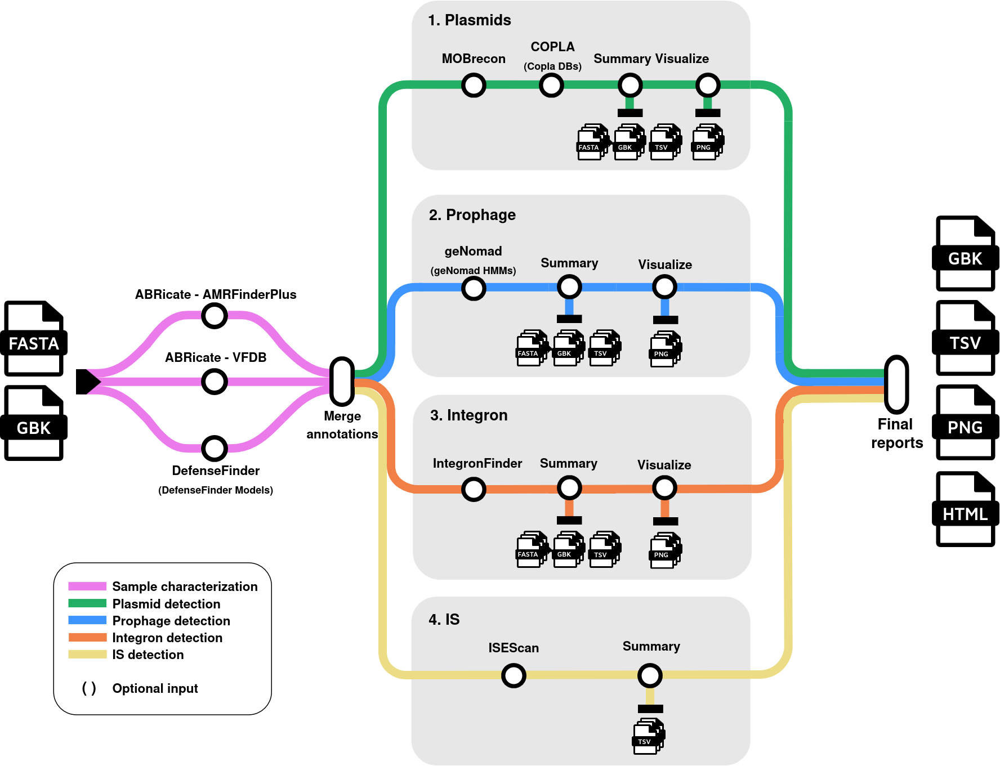

<h1>
  <picture>
    <source media="(prefers-color-scheme: dark)" srcset="docs/images/nf-core-pitisfinder_logo_dark.png">
    
  </picture>
</h1>

[](https://github.com/nf-core/pitisfinder/actions/workflows/ci.yml)
[](https://github.com/nf-core/pitisfinder/actions/workflows/linting.yml)[](https://nf-co.re/pitisfinder/results)[](https://doi.org/10.5281/zenodo.XXXXXXX)
[](https://www.nf-test.com)

[](https://www.nextflow.io/)
[](https://docs.conda.io/en/latest/)
[](https://www.docker.com/)
[](https://sylabs.io/docs/)
[](https://cloud.seqera.io/launch?pipeline=https://github.com/nf-core/pitisfinder)

[](https://nfcore.slack.com/channels/pitisfinder)[](https://twitter.com/nf_core)[](https://mstdn.science/@nf_core)[](https://www.youtube.com/c/nf-core)

## Introduction

**nf-core/pitisfinder** is a bioinformatics pipeline designed for the detection, characterization and classification of Mobile Genetic Elements (MGEs) from bacterial whole-genome assemblies. It takes a samplesheet, FASTA and Genbank files as input, predicts the major MGEs (plasmids, prophages, integrons, Insertion Sequences, Integrative Conjugative Elements), characterizing their most relevant components and classifying them according to different specific MGE criteria. The provided genome is also assessed for relevant functional features like resistance genes, virulence factors and defense systems.

  <picture>
    <source media="(prefers-color-scheme: dark)" srcset="docs/images/nf-core-pitisfinder_logo_dark.png">
    
  </picture>

Implemented tools:
- Plasmids ([`MOBrecon`](github.com/phac-nml/mob-suite/) and [`COPLA`](https://github.com/santirdnd/COPLA))
- Prophages ([`PhiSpy`](https://github.com/linsalrob/PhiSpy))
- Integrons ([`IntegronFinder`](https://integronfinder.readthedocs.io/en/latest/))
- Insertion Sequences ([`ISEScan`](https://github.com/xiezhq/ISEScan))
- Integrative Conjugative Elements ([`ICEFinder2`](https://bioinfo-mml.sjtu.edu.cn/index_bioinfo.php))
- Functional annotation ([`ABRicate`](https://github.com/tseemann/abricate) and [`DefenseFinder`](https://github.com/mdmparis/defense-finder))

## Usage

> [!NOTE]
> If you are new to Nextflow and nf-core, please refer to [this page](https://nf-co.re/docs/usage/installation) on how to set-up Nextflow. Make sure to [test your setup](https://nf-co.re/docs/usage/introduction#how-to-run-a-pipeline) with `-profile test` before running the workflow on actual data.

First, prepare a samplesheet with your input data that looks as follows:

`samplesheet.csv`:

```csv
sample,fasta,gbk
sampleA,sampleA.fasta,sampleA.gbk
```

Now, you can run the pipeline using:

```bash
nextflow run nf-core/pitisfinder \
   -profile <docker/singularity/.../institute> \
   --input samplesheet.csv \
   --outdir <OUTDIR>
```
> [!WARNING]
> Please be aware that `conda` profile is not available, as not all tools can be installed through Conda.

In addition to default nf-core parameters, **pitisfinder also accepts these inputs/options**:
```
Local databases (if not provided, they are automatically downloaded):
  --df_db                   [string] Path to DefenseFinder database. See https://github.com/mdmparis/defense-finder/ for mandatory directory structure and content. 
  --copla_db                [string] Path to Copla databases. See https://github.com/santirdnd/COPLA for mandatory directory structure and content. 
  --phispy_db               [string] Path to pVOG database HMM profiles. Available at https://ftp.ncbi.nlm.nih.gov/pub/kristensen/pVOGs/downloads/All/AllvogHMMprofiles.tar.gz 
```

```
Skipping Options:
  --skip_plasmids           [boolean] Skip plasmid search. [default: false] 
  --skip_integrons          [boolean] Skip integron search. [default: false] 
  --skip_is                 [boolean] Skip IS search. [default: false] 
  --skip_prophages          [boolean] Skip prophage search. [default: false] 
  --skip_ices               [boolean] Skip ICEs search. [default: false]
```

> [!WARNING]
> Please provide pipeline parameters via the CLI or Nextflow `-params-file` option. Custom config files including those provided by the `-c` Nextflow option can be used to provide any configuration _**except for parameters**_; see [docs](https://nf-co.re/docs/usage/getting_started/configuration#custom-configuration-files).

For more details and further functionality, please refer to the [usage documentation](https://nf-co.re/pitisfinder/usage) and the [parameter documentation](https://nf-co.re/pitisfinder/parameters).

## Pipeline output

The output directory will contain a separate folder for each sample. Within each sample folder, the structure will be as follows:

- `Subfolders for each MGE type`: These will contain the results from the corresponding analysis program(s) and a `summary` folder, that includes:
  - Nucleotide sequences in FASTA format.
  - Gene annotations in GenBank format.
  - A tabular report in TSV format for each individual MGE.
  - A tabular report in TSV format for all MGEs of that class found.
  - A genomic plot in PNG format.

- `annotation` directory, which provides:
  - The full genomic annotation in GenBank format, including identified antimicrobial resistance genes, virulence factors, and defense systems.
  - A comprehensive tabular report (TSV) listing all MGEs found.
  - A genomic plot (PNG) summarizing the annotations related to resistance, virulence, and defense features.

To see the results of an example test run with a full size dataset refer to the [results](https://nf-co.re/pitisfinder/results) tab on the nf-core website pipeline page.
For more details about the output files and reports, please refer to the
[output documentation](https://nf-co.re/pitisfinder/output).

## Credits

nf-core/pitisfinder was originally written by [Rosalía Palomino-Cabrera](https://github.com/rpalcab), [Jorge Rodríguez-Grande](https://github.com/Aluminio-visto/).

We thank the following people for their extensive assistance in the development of this pipeline:

[Yolanda Benitez](https://github.com/yolandabq), [Daniel Valle](https://github.com/Daniel-VM), Alba Talavera, [Sara Monzón](https://github.com/saramonzon)

## Contributions and Support

If you would like to contribute to this pipeline, please see the [contributing guidelines](.github/CONTRIBUTING.md).

For further information or help, don't hesitate to get in touch on the [Slack `#pitisfinder` channel](https://nfcore.slack.com/channels/pitisfinder) (you can join with [this invite](https://nf-co.re/join/slack)).

## Citations

<!-- TODO nf-core: Add citation for pipeline after first release. Uncomment lines below and update Zenodo doi and badge at the top of this file. -->
<!-- If you use nf-core/pitisfinder for your analysis, please cite it using the following doi: [10.5281/zenodo.XXXXXX](https://doi.org/10.5281/zenodo.XXXXXX) -->

An extensive list of references for the tools used by the pipeline can be found in the [`CITATIONS.md`](CITATIONS.md) file.

You can cite the `nf-core` publication as follows:

> **The nf-core framework for community-curated bioinformatics pipelines.**
>
> Philip Ewels, Alexander Peltzer, Sven Fillinger, Harshil Patel, Johannes Alneberg, Andreas Wilm, Maxime Ulysse Garcia, Paolo Di Tommaso & Sven Nahnsen.
>
> _Nat Biotechnol._ 2020 Feb 13. doi: [10.1038/s41587-020-0439-x](https://dx.doi.org/10.1038/s41587-020-0439-x).
